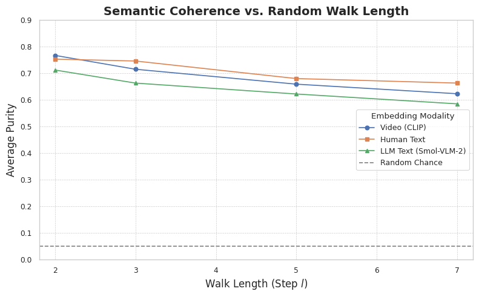
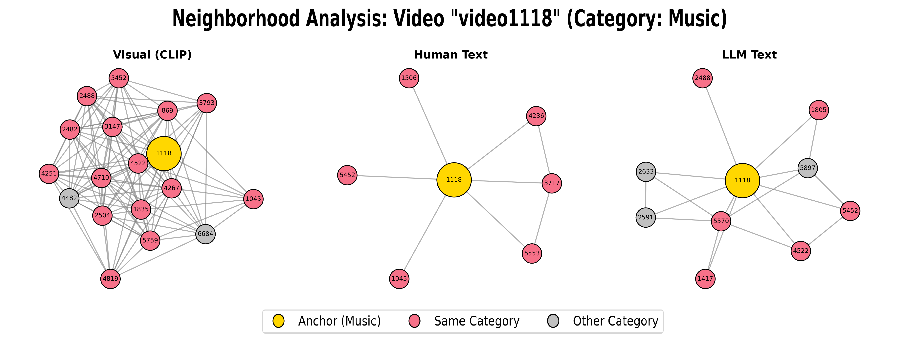
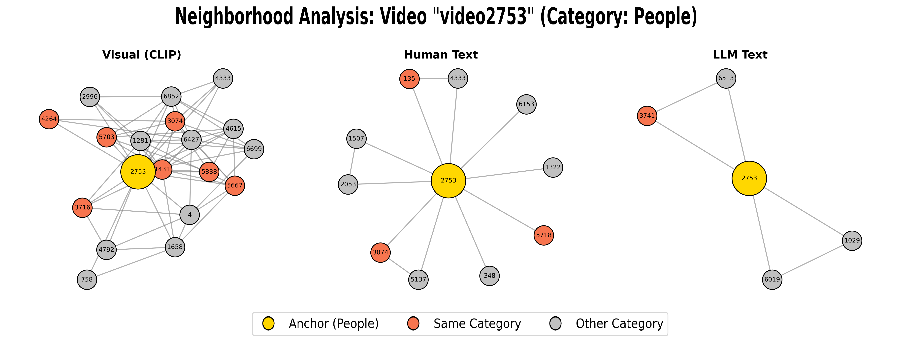

# Code for Short Video Similarity using Graph Representations



*Final comparison of the semantic cohesion of similarity graphs built from human descriptions, AI-generated (LLM) descriptions, and pure visual features (CLIP).*

## Project Overview

This repository contains the code, processed data, and research results comparing the effectiveness of different modalities in building similarity graphs for short videos. Using the **MSR-VTT** dataset, this project constructs and evaluates three types of graphs:

1.  **Visual Graph:** Based on the cosine similarity between visual embeddings extracted with CLIP.
2.  **Human Description Graph:** Based on the semantic similarity (SBERT) between human-provided descriptions from the dataset.
3.  **AI-Generated Description Graph:** Based on the semantic similarity (SBERT) between descriptions generated by an LLM, specifically `smol-vlm-2.0`.

## Qualitative Results: Neighborhood Analysis

To visually demonstrate the structural properties of each graph, we conducted a qualitative analysis of local node neighborhoods. The figures below show a 1-hop neighborhood for a **"Music"** and a **"People"** video, revealing a clear dichotomy between visual and text-based graphs.

The visual graphs (left column in each figure) show high local purity, connecting almost exclusively to same-category videos. This confirms that visual features excel at grouping content with consistent visual themes. In contrast, the text-based graphs (middle and right columns) capture richer, more abstract semantic connections. For instance, the text graphs link the "Music" video to conceptually related but visually distinct categories like performances or specific genres—connections that visual features alone cannot capture. The consistent neighborhood structures between the Human-Text and LLM-Text graphs reinforce that LLM-generated text effectively replicates the complex relational structure of human semantic understanding.


*Figure 1: Neighborhood comparison for a "Music" anchor video.*


*Figure 2: Neighborhood comparison for a "People" anchor video.*

## Workflow and Execution

The process is divided into two Jupyter Notebooks, designed to be run sequentially in **Google Colab**.

### Notebook 1: `notebooks/01_Data_Preprocessing_and_Feature_Extraction.ipynb` (Optional)

&nbsp; &nbsp; This notebook performs the complete preprocessing pipeline, starting from the raw MSR-VTT data. **You only need to run this if you want to replicate the feature extraction from scratch.**

### Notebook 2: `notebooks/02_Graph_Analysis_and_Evaluation.ipynb` (Main)

&nbsp; &nbsp; This notebook conducts the core analysis. It loads the pre-processed data and features, builds the graphs, evaluates their semantic cohesion, and generates the final results plot.

## How to Reproduce the Results

### Step 1: Google Drive Environment Setup

1.  **Clone the Repository to Your Local Machine:**
    ```bash  
    git clone https://github.com/anonymous-1-2/video-similarity-code.git

2.  **Create the Project Folder in Your Google Drive:**
    In the root of your Google Drive (`My Drive`), create the following folder structure: My Drive/D/Dataset/

3.  **Upload the Project Files:**
Upload all `.ipynb`, `.csv`, `.xlsx` files and the `figures/` folder that you cloned from GitHub into the `My Drive/D/Dataset/` directory you just created.

4.  **Add Shortcuts to Data and Features:**
Open the shared Google Drive links below. For each link, instead of downloading, click **"Add shortcut to Drive"** (or the triangle icon with a `+`) and select the `My Drive/D/Dataset/` folder as the destination.

**Required Shortcuts for Analysis (Notebook 2 - Recommended):**
*   `Keyframes/` ([Link](https://drive.google.com/drive/folders/1jiHTEsbit8o5WyVbcNYdRz3I995B8rBs?usp=sharing))
*   `MSRVTT_Features_ViT_L_14_Aggregated/` ([Link](https://drive.google.com/drive/folders/1USB4NbvxpCL_V-RFfqrClmMlPrWggvfu?usp=sharing))
*   `MSRVTT_Features_ViT_L_14_Sequential/` ([Link](https://drive.google.com/drive/folders/1TpshF89NqtFFBqb-IadriWaLu8Eyi5cL?usp=sharing))

**Shortcuts for Full Feature Generation (Optional):**
If you wish to run Notebook 1 from scratch, also add shortcuts for the raw data:
*   `TrainValVideo.zip` ([Link](https://drive.google.com/file/d/1rt4YDdhRblFvYpr3xdvHtff4-jqEWO_6/view?usp=sharing))
*   `train_val_videodatainfo.json`

### Step 2: Running the Notebooks

**Option A: Run Analysis Only (Recommended)**

1.  After setting up your Drive environment with the shortcuts, open the `notebooks/02_Graph_Analysis_and_Evaluation.ipynb` notebook in Google Colab.
2.  **Important Action:** In the Google Colab file browser (left-side panel), click the "Upload to session storage" icon and select the `MSRVTT_dados_compilados_com_features.xlsx` file from your local machine. This will make it directly accessible at the `/content/` path.
3.  Run all cells in the notebook to perform the complete analysis and generate the final results.

**Option B: Full Generation from Scratch**

1.  Ensure the shortcuts for the raw data (`TrainValVideo.zip` and the `.json` file) have been added to your Drive.
2.  Open the `notebooks/01_Data_Preprocessing_and_Feature_Extraction.ipynb` notebook in Google Colab with a GPU runtime (T4 or higher).
3.  Run all cells. This process is time-consuming and may take several hours. The outputs, including the `MSRVTT_dados_compilados_com_features.xlsx` file, will be saved to your Google Drive.
4.  Once complete, proceed with **Option A**, uploading the newly generated `.xlsx` file to the Colab session as instructed.

## Dependencies

The main libraries are installed directly within the notebooks using `!pip install` commands. Key dependencies include: `transformers`, `torch`, `sentence-transformers`, `networkx`, `pandas`, `scikit-learn`, `matplotlib`, `seaborn`, and `tqdm`.

## Author
**GitHub:** https://github.com/anonymous-1-2
